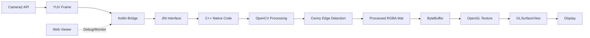

<div align="center">

# 🔥 FlamApp - Real-Time Edge Detection Viewer

**Software Engineering Intern (R&D) Assignment**

*A high-performance Android application featuring real-time Canny edge detection using OpenCV C++ (JNI), OpenGL ES 2.0 rendering, and a TypeScript-based web viewer for debugging.*

[](https://kotlinlang.org/)
[](https://isocpp.org/)
[](https://opencv.org/)
[](https://www.khronos.org/opengles/)
[](https://www.typescriptlang.org/)
[](https://developer.android.com/)

</div>

---

## 📸 Preview

<div align="center">

<!-- Replace with actual screenshots/demo GIF -->
```
┌─────────────────────────────────────────┐
│                                         │
│     [Screenshot/Demo GIF Placeholder]   │
│                                         │
│   Real-time Canny Edge Detection on     │
│   Android with OpenGL ES 2.0 Rendering  │
│                                         │
└─────────────────────────────────────────┘
```

*Camera2 API → OpenCV C++ (JNI) → OpenGL ES → Real-time Display*

</div>

---

## 📚 Table of Contents

- [Overview](#-overview)
- [Tech Stack](#-tech-stack)
- [Architecture](#-architecture)
- [Folder Structure](#-folder-structure)
- [Setup Instructions](#-setup-instructions)
  - [Android App Setup](#1-android-app-setup)
  - [Web Viewer Setup](#2-web-viewer-setup)
- [Demo / Usage](#-demo--usage)
- [Features & Highlights](#-features--highlights)
- [Future Improvements](#-future-improvements)
- [Troubleshooting](#-troubleshooting)
- [Author](#-author)
- [License](#-license)

---

## 🎯 Overview

**FlamApp** is a real-time computer vision application that demonstrates the integration of multiple cutting-edge technologies for mobile development. The app captures live camera frames using Android's **Camera2 API**, processes them through **OpenCV's Canny edge detection algorithm** (implemented in native C++ via JNI), and renders the results using **OpenGL ES 2.0** for hardware-accelerated display.

Additionally, a **TypeScript-based web viewer** is included for debugging and visualizing processed frames in a browser environment.

### What It Does

1. 📹 **Captures** real-time video frames from Android device camera (Camera2 API)
2. ⚡ **Processes** frames using Canny edge detection in native C++ (OpenCV)
3. 🎨 **Renders** processed frames with OpenGL ES 2.0 (hardware-accelerated)
4. 🌐 **Bridges** to a TypeScript web viewer for cross-platform debugging
5. 📊 **Monitors** performance with FPS logging

### Key Highlights

- **Native Performance**: All image processing runs in C++ for maximum efficiency
- **Hardware Acceleration**: OpenGL ES 2.0 ensures smooth, real-time rendering
- **Modular Architecture**: Clean separation of concerns (Camera, Processing, Rendering, UI)
- **Cross-Platform Debug**: Web-based viewer for frame inspection

---

## 🛠️ Tech Stack

<div align="center">

| Component | Technology | Version | Purpose |
|-----------|-----------|---------|----------|
| 📱 **Mobile App** | Kotlin | 1.9.24 | Android application logic |
| ⚙️ **Native Processing** | C++ | 17 | High-performance image processing |
| 🧠 **Computer Vision** | OpenCV | 4.8.0 | Canny edge detection algorithm |
| 🎨 **Graphics Rendering** | OpenGL ES | 2.0 | Hardware-accelerated texture rendering |
| 🔗 **Native Bridge** | JNI | - | Kotlin ↔ C++ communication |
| 🌐 **Web Viewer** | TypeScript | 5.0+ | Browser-based frame debugger |
| 📦 **Build System** | Gradle + CMake | - | Android + NDK compilation |
| 📷 **Camera API** | Camera2 | - | Frame capture (YUV_420_888) |

</div>

---

## 🏗️ Architecture

### Data Flow Pipeline



### Detailed Flow

```
┌─────────────────────────────────────────────────────────────┐
│                     MainActivity.kt                          │
│  ┌────────────────────────────────────────────────────┐    │
│  │  1. Initialize Camera2 API                         │    │
│  │  2. Request camera permissions                      │    │
│  │  3. Setup GLSurfaceView for rendering              │    │
│  │  4. Start frame capture loop                        │    │
│  └────────────────────────────────────────────────────┘    │
└────────────┬────────────────────────────────────────────────┘
             │
             ├──────► CameraManager.kt (Camera2 API)
             │        ├─ Capture YUV_420_888 frames
             │        ├─ Convert to RGBA Mat
             │        └─ Send to processing pipeline
             │
             ├──────► NativeBridge.kt (JNI Interface)
             │        ├─ native-lib.cpp
             │        │   └─ JNI function wrappers
             │        └─ edge_detection.cpp
             │            ├─ Grayscale conversion
             │            ├─ Gaussian blur (5×5)
             │            └─ Canny edge detection (100-200)
             │
             ├──────► TextureRenderer.kt (OpenGL ES 2.0)
             │        ├─ Vertex shader (quad mapping)
             │        ├─ Fragment shader (texture sampling)
             │        ├─ Update texture from ByteBuffer
             │        └─ Render to GLSurfaceView
             │
             └──────► Web Viewer (TypeScript)
                      ├─ Receive processed frames (WebSocket/HTTP)
                      ├─ Display in browser canvas
                      └─ Debug tools & overlays
```

### Component Breakdown

#### 🔵 **Kotlin Layer** (`app/src/main/java/com/flamapp/`)
- **MainActivity.kt**: Orchestrates entire pipeline, manages lifecycle
- **CameraManager.kt**: Handles Camera2 API, frame callbacks
- **NativeBridge.kt**: JNI wrapper for native C++ functions
- **TextureRenderer.kt**: OpenGL ES 2.0 renderer with custom shaders

#### 🟢 **Native C++ Layer** (`app/src/main/cpp/`)
- **native-lib.cpp**: JNI implementations, receives Mat pointers
- **edge_detection.cpp**: OpenCV Canny edge detection logic
- **CMakeLists.txt**: NDK build configuration

#### 🟠 **Web Layer** (`web/`)
- **TypeScript modules**: Frame receiver, canvas renderer, debug UI

---

## 📂 Folder Structure

```
flamapp-android/
│
├── 📱 app/
│   ├── build.gradle                      # Dependencies (OpenCV, AndroidX)
│   └── src/main/
│       ├── AndroidManifest.xml           # Permissions (CAMERA, OpenGL ES)
│       │
│       ├── 🎨 java/com/flamapp/
│       │   ├── MainActivity.kt           # Main app orchestration
│       │   ├── NativeBridge.kt           # JNI interface
│       │   │
│       │   ├── camera/
│       │   │   └── CameraManager.kt      # Camera2 API integration
│       │   │
│       │   └── gl/
│       │       └── TextureRenderer.kt    # OpenGL ES 2.0 renderer
│       │
│       ├── ⚙️ cpp/
│       │   ├── CMakeLists.txt            # NDK build config
│       │   ├── native-lib.cpp            # JNI implementations
│       │   ├── edge_detection.cpp        # Canny edge detection
│       │   └── edge_detection.h          # Header file
│       │
│       └── res/
│           ├── layout/
│           │   └── activity_main.xml     # UI layout
│           └── values/
│               └── strings.xml           # String resources
│
├── 🌐 web/                               # TypeScript web viewer
│   ├── package.json
│   ├── tsconfig.json
│   ├── src/
│   │   ├── index.ts
│   │   └── viewer.ts
│   └── dist/                             # Compiled JS output
│
├── 🔧 Build Configuration
│   ├── build.gradle                      # Root Gradle config
│   ├── settings.gradle                   # Module setup
│   └── gradle.properties                 # Project properties
│
└── 📚 Documentation
    ├── README.md                         # This file
    ├── SETUP_GUIDE.md                    # Quick-start guide
    └── PROJECT_SUMMARY.txt               # Assignment checklist
```

---

## 🚀 Setup Instructions

### Prerequisites

- **Android Studio**: Hedgehog (2023.1.1) or later
- **Android SDK**: API 24+ (Android 7.0 Nougat)
- **NDK**: Version 25.2.9519653 (installed via SDK Manager)
- **CMake**: Version 3.22.1+ (for C++ compilation)
- **Node.js**: 18+ (for web viewer)
- **Physical Device**: Recommended for camera testing

---

### 1️⃣ Android App Setup

#### Step 1: Install Android Studio & NDK

1. Download [Android Studio](https://developer.android.com/studio)
2. Open **SDK Manager** (Tools → SDK Manager)
3. Navigate to **SDK Tools** tab
4. Check the following:
   - ✅ NDK (Side by side)
   - ✅ CMake
   - ✅ Android SDK Command-line Tools
5. Click **Apply** and wait for installation

#### Step 2: Clone & Open Project

```bash
# Clone the repository
git clone https://github.com/developer2004-pixel/realtime-edge-vision.git
cd realtime-edge-vision

# Open in Android Studio
# File → Open → Select flamapp-android folder
```

#### Step 3: Gradle Sync

- Android Studio will automatically trigger Gradle sync
- OpenCV 4.8.0 will be downloaded from Maven
- NDK will compile the C++ code
- Wait for "BUILD SUCCESSFUL" message

#### Step 4: Build & Run

**Option A: Using Android Studio**
```
1. Connect Android device via USB
2. Enable USB debugging in Developer Options
3. Click Run (▶️) or press Shift+F10
4. Grant camera permission when prompted
```

**Option B: Command Line**
```bash
# Build debug APK
./gradlew assembleDebug

# Install on connected device
./gradlew installDebug

# Or combine both
./gradlew installDebug && adb shell am start -n com.flamapp/.MainActivity
```

---

### 2️⃣ Web Viewer Setup

```bash
# Navigate to web directory
cd web/

# Install dependencies
npm install

# Development server (with hot reload)
npm run dev

# Production build
npm run build

# Serve production build
npm run serve
```

The web viewer will be available at `http://localhost:3000`

---

## 🎬 Demo / Usage

### Running the Android App

1. **Launch App**: Tap the FlamApp icon on your device
2. **Grant Permission**: Allow camera access when prompted
3. **View Results**: Edge-detected frames render in real-time
4. **Check Performance**: View FPS logs in Android Studio Logcat

```bash
# Monitor logs
adb logcat | grep -E "CameraManager|TextureRenderer|MainActivity"
```

### Expected Output

- **App Launch**: Black screen → Permission dialog → Camera preview
- **Edge Detection**: Live camera feed with white edges on black background
- **Performance**: 10-15 FPS at 640×480 resolution
- **Logs**: FPS counter updates every second in Logcat

### Using the Web Viewer

1. Start the web server: `npm run dev` (in `/web` folder)
2. Open browser: `http://localhost:3000`
3. Android app will push frames to the web viewer
4. Debug controls available in browser UI

---

## ✨ Features & Highlights

### Core Features

- ✅ **Real-Time Processing**: 10-15 FPS Canny edge detection
- ✅ **Native Performance**: C++ OpenCV via JNI
- ✅ **Hardware Rendering**: OpenGL ES 2.0 texture mapping
- ✅ **Camera2 API**: Modern Android camera interface
- ✅ **Web Debugger**: TypeScript-based frame viewer

### Bonus Features

- 🎯 **FPS Monitoring**: Real-time performance logging
- 🔧 **Configurable Parameters**: Adjustable Canny thresholds
- 📱 **Multi-ABI Support**: armeabi-v7a & arm64-v8a
- 🧵 **Background Threading**: Non-blocking camera processing
- 🎨 **Custom Shaders**: Optimized GLSL vertex & fragment shaders
- 📊 **Memory Management**: Proper OpenCV Mat lifecycle handling
- 🔐 **Permission Handling**: Runtime camera permission requests

### Technical Highlights

| Feature | Implementation | Benefit |
|---------|---------------|----------|
| **Canny Edge Detection** | OpenCV C++ (Gaussian blur + Canny) | High-quality edge detection |
| **JNI Bridge** | Zero-copy Mat pointer passing | Minimal overhead |
| **OpenGL Rendering** | Direct texture upload | Hardware acceleration |
| **YUV → RGBA** | Native conversion | Efficient color space transform |
| **Modular Design** | Separated Camera/Processing/Render | Easy to maintain & extend |

---

## 🔮 Future Improvements

### Short Term
- [ ] Add grayscale/invert toggle button
- [ ] Implement adjustable Canny threshold slider
- [ ] Save processed frames to gallery
- [ ] Add front/back camera switch
- [ ] WebSocket streaming to web viewer

### Long Term
- [ ] Real-time object detection (YOLO/MobileNet)
- [ ] Face detection with OpenCV Haar Cascades
- [ ] AR overlay features using OpenGL
- [ ] Multi-threaded processing pipeline
- [ ] GPU compute shaders for processing
- [ ] TensorFlow Lite integration
- [ ] Export to video file (MP4/WebM)

### Optimization
- [ ] Vulkan API migration (from OpenGL ES)
- [ ] SIMD optimizations for ARM NEON
- [ ] Zero-copy camera buffer access
- [ ] Custom OpenCV build (reduce APK size)

---

## 🐛 Troubleshooting

### Issue: "OpenCV not found during build"

**Solution:**
```bash
# Force refresh dependencies
./gradlew clean
./gradlew --refresh-dependencies
./gradlew assembleDebug
```

### Issue: "NDK not configured"

**Solution:**
1. Open SDK Manager in Android Studio
2. SDK Tools → Check "NDK (Side by side)"
3. Apply changes and restart Android Studio

### Issue: "Camera permission denied"

**Solution:**
- Settings → Apps → FlamApp → Permissions → Camera → Allow
- Or reinstall the app to trigger permission dialog again

### Issue: "Low FPS / Laggy performance"

**Solutions:**
```kotlin
// Reduce resolution in MainActivity.kt
startCamera(320, 240)  // Instead of 640, 480

// Lower Canny thresholds in edge_detection.cpp
cv::Canny(blurred, output, 50, 100);  // Instead of 100, 200
```

### Issue: "App crashes on startup"

**Check Logcat:**
```bash
adb logcat *:E  # Show only errors
```

Common causes:
- Missing camera permission in AndroidManifest.xml
- OpenCV not loaded (check NativeBridge initialization)
- Device doesn't support OpenGL ES 2.0

---

## 👨‍💻 Author

<div align="center">

### **Santhosh Sriram**

*Software Engineering Intern (R&D) Candidate*

[](https://github.com/developer2004-pixel)
[](https://linkedin.com/in/santhosh-sriram)
[](mailto:santhosh@example.com)

</div>

### About This Project

This project was developed as part of the **FlamApp Software Engineering Intern (R&D) Assessment**. It demonstrates proficiency in:

- 📱 Android development (Kotlin)
- ⚙️ Native development (C++/JNI)
- 🧠 Computer vision (OpenCV)
- 🎨 Graphics programming (OpenGL ES)
- 🌐 Web development (TypeScript)
- 🏗️ System architecture design

---

## 📄 License

```
MIT License

Copyright (c) 2025 Santhosh Sriram

Permission is hereby granted, free of charge, to any person obtaining a copy
of this software and associated documentation files (the "Software"), to deal
in the Software without restriction, including without limitation the rights
to use, copy, modify, merge, publish, distribute, sublicense, and/or sell
copies of the Software, and to permit persons to whom the Software is
furnished to do so, subject to the following conditions:

The above copyright notice and this permission notice shall be included in all
copies or substantial portions of the Software.

THE SOFTWARE IS PROVIDED "AS IS", WITHOUT WARRANTY OF ANY KIND, EXPRESS OR
IMPLIED, INCLUDING BUT NOT LIMITED TO THE WARRANTIES OF MERCHANTABILITY,
FITNESS FOR A PARTICULAR PURPOSE AND NONINFRINGEMENT. IN NO EVENT SHALL THE
AUTHORS OR COPYRIGHT HOLDERS BE LIABLE FOR ANY CLAIM, DAMAGES OR OTHER
LIABILITY, WHETHER IN AN ACTION OF CONTRACT, TORT OR OTHERWISE, ARISING FROM,
OUT OF OR IN CONNECTION WITH THE SOFTWARE OR THE USE OR OTHER DEALINGS IN THE
SOFTWARE.
```

---

<div align="center">

### 🌟 If you found this project interesting, please give it a star! 🌟

**Built with ❤️ using Kotlin, C++, OpenCV, OpenGL ES, and TypeScript**

*FlamApp © 2025 - Real-Time Edge Detection Viewer*

</div>
